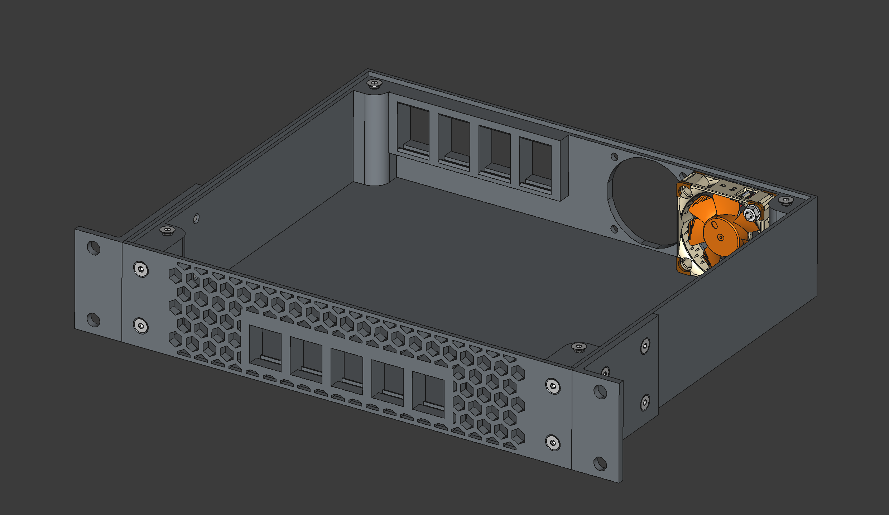
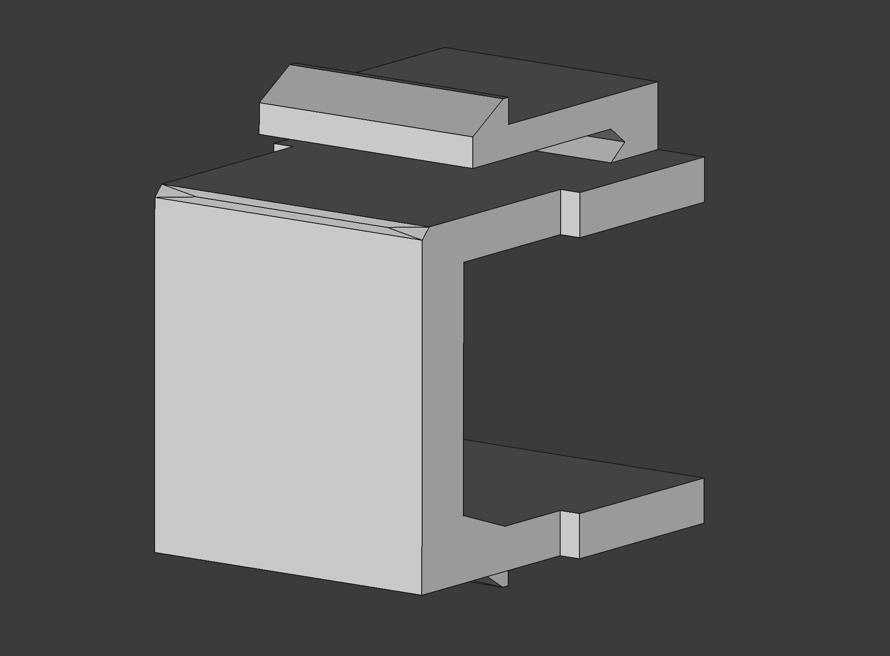
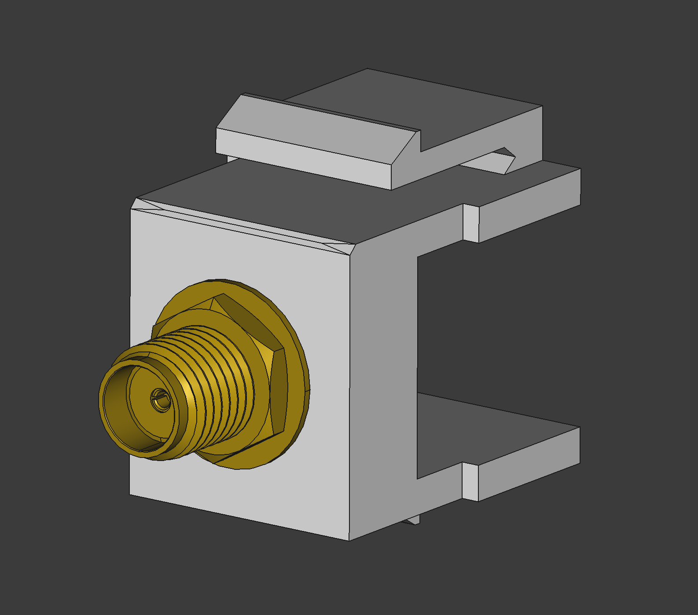
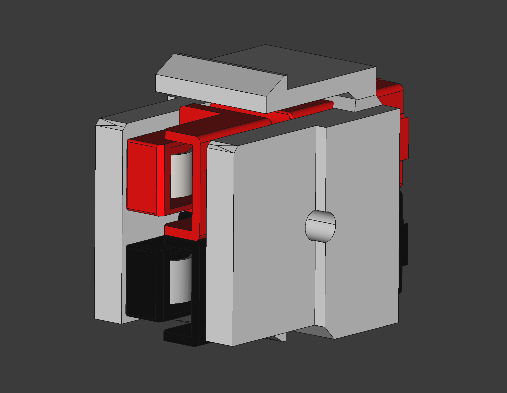

# Rack Stuff

A collection of resources for Rack-mount equipment, from custom keystone ports to 10" and 19" rackable housings.

## Hardware

### Boxes

#### 10" Parametric Rack box

> TODO : Add `.obj`/`.3mf` exports for easy 3D printing  
> TODO : Add assembly instructions  
> TODO : Add bill of materials  
> TODO : Add dimensional drawings  
> TODO : Add more photos of printed/assembled boxes  
> TODO : Add CAD parameters for side-by-side bolting of 10" boxes in a 19" rack  

A customizable 10" rack box design, parametric and adaptable to different heights and depths.

The paramletric design is made with FreeCAD. You can download the [FreeCAD project file](hardware/CAD/Boxes/Rack%20box.FCStd).  
By default, the box is configured as a 1U height and 180mm depth, with 5 Keystone ports on the front panel, 4 Keystone ports on the back, and two 40mm fan holes on the back side.  
It is also possible to put two boxes side by side in a 19" rack, but the CAD has to be modified to allow bolting the boxes together.

### Keystone Ports

#### Blank Keystone Port

> TODO : Add `.obj`/`.3mf` exports for easy 3D printing

#### SMA Keystone Port

> TODO : Add `.obj`/`.3mf` exports for easy 3D printing

#### Anderson Powerpole Keystone Port

> TODO : Add `.obj`/`.3mf` exports for easy 3D printing

> Note : The Powerpole connectors in the CAD are only for illustration purposes.

#### IEC 60320 C6 Keystone Port

> **Work in progress**  
> TODO : Add `.obj`/`.3mf` exports for easy 3D printing

## License & Acknowledgements

Made with ❤️, lots of ☕️, and lack of 🛌  
Published under CreativeCommons BY-SA 4.0

  
This work is licensed under a [Creative Commons Attribution-ShareAlike 4.0 International License](http://creativecommons.org/licenses/by-sa/4.0/).
